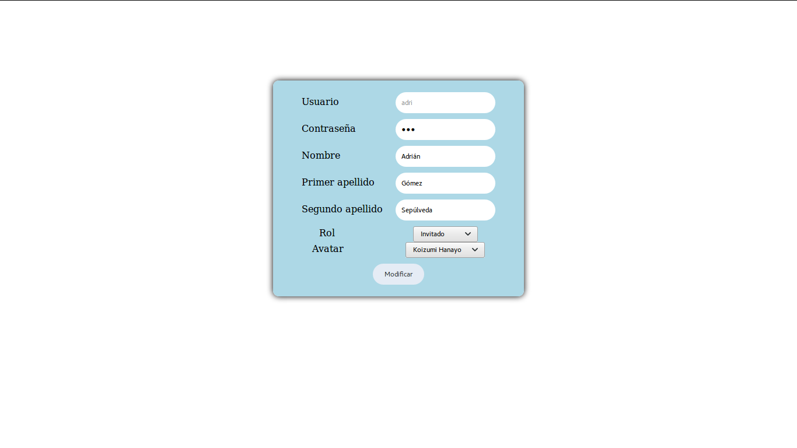

# CRUD

Página de Login

Ésta es la pantalla en la que nos logearemos como uno de los usuarios dados de alta.

Página de visualización de usuarios

En ésta pagina veremos todos los usuarios que están registrados en la base de datos.

Dependiendo de si el usuario logeado es administrador o no podrá dar de alta usuarios, modificarlos o borrarlos.

Página de modificación de usuarios

Ésta pagina nos permite modificar el usuario que hemos seleccionado anteriormente en la página en la que visualizamos los usuarios.

Página para añadir usuarios

Aquí podemos añadir nuevos usuarios a la base de datos
